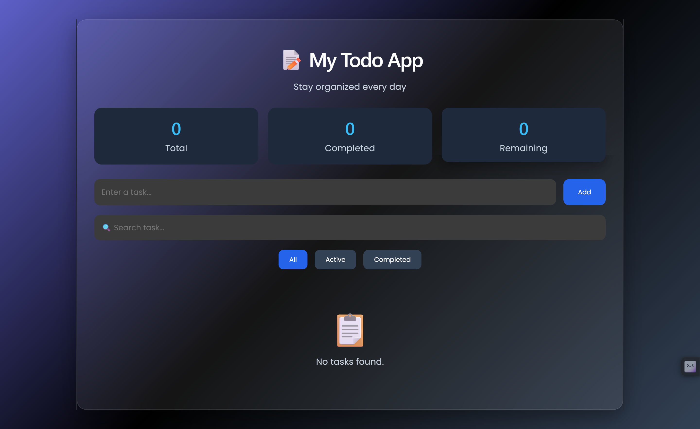
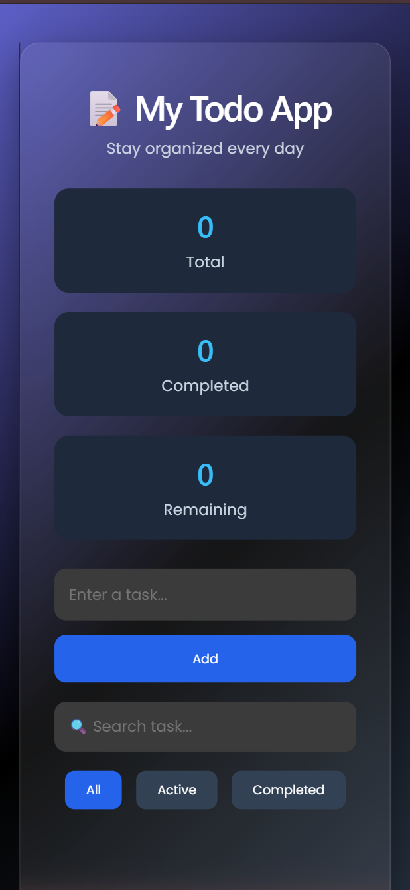

# 📝 React Todo App

A modern, responsive, and user-friendly **Todo Application** built with **React** and **Vite**. This project allows users to efficiently manage daily tasks with features such as adding, editing, deleting, searching, filtering, and persisting tasks using the browser's Local Storage.

---

## 📖 Overview

The React Todo App is designed to demonstrate fundamental React concepts while providing a clean and intuitive user interface. It showcases state management, event handling, conditional rendering, and data persistence, making it an excellent beginner-to-intermediate React project.

---

## ✨ Features

- ➕ Add new tasks
- ✏️ Edit existing tasks
- ✅ Mark tasks as completed or undo completion
- 🗑️ Delete tasks
- 🔍 Search tasks in real time
- 📂 Filter tasks (All, Active, Completed)
- 💾 Automatically save tasks using Local Storage
- 📊 Task statistics (Total, Completed, Remaining)
- ⌨️ Add tasks by pressing the **Enter** key
- 📱 Responsive design for desktop, tablet, and mobile devices
- 🎨 Modern user interface with smooth hover effects

---

## 📸 Screenshots

### Desktop View



### Mobile View



---

## 🛠️ Tech Stack

- **React**
- **Vite**
- **JavaScript (ES6+)**
- **CSS3**
- **HTML5**
- **Local Storage API**

---

## 📂 Project Structure

```text
todoapp/
│
├── public/
│   ├── favicon.svg
│   └── icons.svg
│
├── screenshots/
│   ├── home.png
│   └── mobile.png
│
├── src/
│   ├── assets/
│   ├── App.jsx
│   ├── App.css
│   ├── index.css
│   └── main.jsx
│
├── .gitignore
├── eslint.config.js
├── index.html
├── package.json
├── package-lock.json
├── vite.config.js
└── README.md
```

---

## 🚀 Getting Started

### 1. Clone the repository

```bash
git clone https://github.com/YOUR_USERNAME/react-todo-app.git
```

### 2. Navigate to the project directory

```bash
cd react-todo-app
```

### 3. Install dependencies

```bash
npm install
```

### 4. Start the development server

```bash
npm run dev
```

Open your browser and visit:

```text
http://localhost:5173
```

---

## 📦 Build for Production

```bash
npm run build
```

Preview the production build:

```bash
npm run preview
```

---

## 📋 Available Scripts

| Command | Description |
|---------|-------------|
| `npm install` | Install project dependencies |
| `npm run dev` | Start the development server |
| `npm run build` | Build the project for production |
| `npm run preview` | Preview the production build |

---

## 📚 What I Learned

This project helped me strengthen my understanding of:

- React Functional Components
- React Hooks (`useState`, `useEffect`)
- State Management
- CRUD Operations
- Event Handling
- Conditional Rendering
- Local Storage
- Responsive UI Design
- Modern CSS Styling

---

## 🎯 Future Improvements

- 🌙 Dark / Light Theme Toggle
- 📅 Due Dates
- 🏷️ Task Categories
- ⭐ Task Priorities
- 🔔 Toast Notifications
- ☁️ Cloud Synchronization (Firebase)

---

## 👨‍💻 Author

Samyak Dutta

<!-- - GitHub: https://github.com/YOUR_USERNAME
- LinkedIn: https://linkedin.com/in/YOUR_LINKEDIN *(optional)* -->

---

## 🤝 Contributing

Contributions are welcome!

1. Fork this repository.
2. Create a new feature branch.
3. Commit your changes.
4. Push to your branch.
5. Open a Pull Request.

---

## 📄 License

This project is licensed under the **MIT License**.

See the [LICENSE](LICENSE) file for details.

---

## ⭐ Show Your Support

If you found this project helpful or interesting, please consider giving it a **⭐ Star** on GitHub.

It helps support the project and encourages future improvements.

---

Made with ❤️ using **React**.